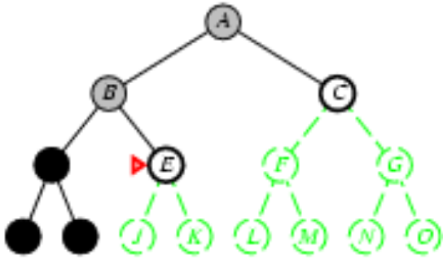

**Bloc 1 – Representació del coneixement i cerca** 

**Tema 4:**   

**Resolució de problemes mitjançant cerca.**  

**Cerca no informada**. ![ref1]

**Sistemes Intel·ligents, ETSInf, Universitat Politècnica de València          Bloc1, Tema 4. Cerca no informada.     pp.  1** ![ref2]![ref3]![ref4]![ref5]![ref6]![ref7]![ref8]

**Tema 4 - Cerca no informada** 

1. Definició del problema: recordatori i exemple 
1. Cerca de solucions 
1. Estratègia en amplària 
1. Estratègia de cost uniforme 
1. Estratègia en profunditat 
1. Cerca en CLIPS 
1. Estratègia per aprofundiment iteratiu 

**Bibliografia** 

S. Russell, P. Norvig. ***Intel·ligència Artificial. Un enfocament modern.*** Prentice Hall, 2nd edition, 2004 (Capítol 3) <http://aima.cs.berkeley.edu/2nd-ed/> ![ref1]

**Sistemes Intel·ligents, ETSInf, Universitat Politècnica de València          Bloc1, Tema 4. Cerca no informada.     pp.  2** ![ref2]![ref3]![ref4]![ref5]![ref6]![ref7]![ref8]

**2. Cerca de solucions** 

Procés general de cerca 

1. node-actual <- Estat inicial del problema 
1. Comprovar si node-actual és l'estat final del problema; en aquest cas, FI. 
1. Expandir node-actual aplicant les accions del problema en aquest estat i generant el conjunt de nous estats. 
1. Escollir un node que no ha sigut expandit encara (node-actual) 
1. Anar al pas 2 

El conjunt de nodes no expandits es denomina conjunt frontera, nodes fulla o llista OPEN. ![ref1]

**Sistemes Intel·ligents, ETSInf, Universitat Politècnica de València          Bloc1, Tema 4. Cerca no informada.     pp.  6** ![ref2]![ref3]![ref4]![ref5]![ref6]![ref7]![ref8]

**2. Cerca de solucions: cerca en arbre** 

**node arrel: nivell 0 (profunditat 0) **

OPEN={Arad} 

Escollir node i   eliminar-ho de la llista  (expansió del node) 

Arad objectiu?: NO  Generar  

`   `fills 

**node arrel: nivell 0 (profunditat 0) **

**nivell 1 (prof. 1)** 

OPEN={Sibiu Timisoara Zerind} 

Escollir node i   eliminar-ho de la llista  (expansió del node) 

Sibiu objectiu?: NO 

Generar fills 

**Sistemes Intel·ligents, ETSInf, Universitat Politècnica de València          Bloc1, Tema 4. Cerca no informada.     pp.  7** ![ref2]![ref3]![ref4]![ref5]![ref6]![ref7]![ref8]![ref1]

` `Escollir node de la llista OPEN; i.g. Sibiu 

**2. Cerca de solucions: cerca en arbre** 

**node arrel (nivell 0, profunditat 0) **

**nivell 1 (prof. 1)** 

**nivell 2 (prof. 2)** 

` `OPEN =  {Timisoara  Zerind Arad Fagaras Oradea Rimnicu Vilcea} ![ref1]

**Sistemes Intel·ligents, ETSInf, Universitat Politècnica de València          Bloc1, Tema 4. Cerca no informada.     pp.  8** ![ref2]![ref3]![ref4]![ref5]![ref6]![ref7]![ref8]

**2. Cerca de solucions: algorisme TREE-SEARCH** 

- Els algorismes de cerca comparteixen l'estructura bàsica vista anteriorment; es diferencien, bàsicament, en l'elecció del següent node a expandir (**estratègia de cerca**). 

**function** TREE-SEARCH (*problema*) **return** una solució o fallada 

Inicialitzar la llista OPEN amb l'estat inicial del problema 

**do**   estratègia de  

**if** llista OPEN està buida **then** **return** *fallada*  cerca expandir un node: escollir node fulla i eliminar-ho de la llista OPEN 

**if** node escollit és l'estat final **then** **return** la corresponent *solució* 

generar fills i afegir els nodes resultants a la llista OPEN 

**enddo** ![ref1]

**Sistemes Intel·ligents, ETSInf, Universitat Politècnica de València          Bloc1, Tema 4. Cerca no informada.     pp.  9** ![ref2]![ref3]![ref4]![ref5]![ref6]![ref7]![ref8]

**2. Cerca de solucions: estats repetits** 

Arbre de cerca ≠ Espai d'estats  (l'arbre de cerca pot contenir estats repetits i cicles); e.g.: l'espai d'estats del problema ‘Romania’ solament té 20 estats mentre que l'arbre complet de cerca és infinit) 

Estats repetits: 

\-  Accions reversibles: cicles camins redundants 

Arad 

Arad  g(Arad)=0  Arad 

140  75 

Sibiu  g(Zerind)=75 Sibiu  Sibiu  Zerind 

g(Sibiu)=140 

Zerind  71 

Arad  Oradea  g(Oradea)=146 

Oradea  151 

`  `node repetit:  

antecessor directe  Sibiu  g(Sibiu)=297 

` `Arad 

node repetit: antecessor en el camí ![ref1]

**Sistemes Intel·ligents, ETSInf, Universitat Politècnica de València          Bloc1, Tema 4. Cerca no informada.     pp.  10** ![ref2]![ref3]![ref4]![ref5]![ref6]![ref7]![ref8]

**2. Cerca de solucions: estats repetits** 

Com evitar estats repetits 

- Incloure en l'algorisme TREE-SEARCH una estructura de dades per a guardar els nodes explorats o expandits (llista CLOSED) 
- Quan es genera un nou node, si aquest es troba en la llista CLOSED (nodes ja expandits) o en la llista OPEN (nodes encara no expandits) es pot eliminar en lloc d'afegir-ho a la llista OPEN 
- Nou algorisme: GRAPH-SEARCH, algorisme que separa el graf de l'espai d'estats en dues regions: la regió de nodes explorats/expandits i la regió de nodes no expandits. 

` `En general, evitar nodes repetits i camins redundants és solament una qüestió d'eficiència. ![ref1]

**Sistemes Intel·ligents, ETSInf, Universitat Politècnica de València          Bloc1, Tema 4. Cerca no informada.     pp.  11** ![ref2]![ref3]![ref4]![ref5]![ref6]![ref7]![ref8]

**2. Cerca de solucions: algorisme GRAPH-SEARCH** 

La llista OPEN s'implementa com una cua de prioritats (priority queue): s'extrau  l'element de la cua amb la màxima prioritat d'acord a una funció d'avaluació (llista ordenada de manera que el primer element de la cua és el que té major prioritat) 

Per a cada estratègia de cerca es defineix una funció d'avaluació (f(n)) que retorna un valor numèric per al node **n** tal que el node s'insereix en la cua de prioritats en el mateix ordre en el qual seria expandit per l'estratègia de cerca. ![ref1]

**Sistemes Intel·ligents, ETSInf, Universitat Politècnica de València          Bloc1, Tema 4. Cerca no informada.     pp.  12** ![ref2]![ref3]![ref4]![ref5]![ref6]![ref7]![ref8]

2. **Cerca de solucions: algorisme GRAPH-SEARCH** 

**function** GRAPH-SEARCH (*problema*) **return** una solució o una fallada 

Inicialitzar la llista OPEN amb l'estat inicial del problema* 

Inicialitzar la llista CLOSED a buit 

**do**  

`     `**if**  OPEN està buida **then** **return** *fallada* 

`    `p <- pop (llista OPEN) 

`     `afegir p a la llista CLOSED 

`     `**if** p = estat final **then** **return** *solució* p 

`             `generar fills de p 

`      `per a cada fill n de p : 

aplicar f(n) 

`             `**if** n no està en CLOSED **then** 

`     `**if** n no està en OPEN o (n està repetit en OPEN i f(n) és millor que el valor del node              en OPEN) **then** 

`                `inserir n en ordre creixent de f(n) en OPEN\* 

**else** f(n) és millor que el valor del node repetit en CLOSED **then** 

`               `escollir entre re-expandir n (inserir-ho en OPEN) o descartar-lo 

**enddo** 

* Com estem interessats a trobar únicament la primera solució, es pot eliminar n’ de la llista OPEN **![ref1]**

**Sistemes Intel·ligents, ETSInf, Universitat Politècnica de València          Bloc1, Tema 4. Cerca no informada.     pp.  13** ![ref2]![ref3]![ref4]![ref5]![ref6]![ref7]![ref8]

**Cerca en arbre (TREE-SEARCH)**: 

- manté la llista OPEN però no la llista CLOSED amb tots els nodes expandits (menys memòria) 
- pot evitar estats repetits en la llista OPEN 
- re-expandeix nodes ja explorats 

**Cerca en graf (GRAPH-SEARCH)**: 

- manté la llista OPEN i CLOSED (majors requeriments de memòria) 
- control d'estats repetits i camins redundants (reducció de la cerca) ![ref1]

**Sistemes Intel·ligents, ETSInf, Universitat Politècnica de València          Bloc1, Tema 4. Cerca no informada.     pp.  14** ![ref2]![ref3]![ref4]![ref5]![ref6]![ref7]![ref8]

**2. Cerca de solucions: propietats** 

Avaluarem les estratègies de cerca d'acord a: 

1. Completitud 
1. Complexitat temporal 
1. Complexitat espacial 
1. Optimalitat 

Solucions que representen un balanç entre: 

- cost del camí solució: g(estat\_final) 
- cost de la cerca: cost de trobar el camí solució 

Tipus d'estratègies de cerca: 

1. no informada  o cerca cega (ordre d'expansió dels nodes) 
1. Informada o cerca heurística (expansió ‘intel·ligent’ dels nodes) ![ref1]

**Sistemes Intel·ligents, ETSInf, Universitat Politècnica de València          Bloc1, Tema 4. Cerca no informada.     pp.  15** ![ref2]![ref3]![ref4]![ref5]![ref6]![ref7]![ref8]

Expandir el node menys profund (entre els nodes de la llista OPEN) 

**nivell 0  nivell 1**  

**nivell 2  nivell 3**  

Funció d'avaluació (cua de prioritats): f(n)=nivell(n)=profunditat(n) ![ref1]

**Sistemes Intel·ligents, ETSInf, Universitat Politècnica de València          Bloc1, Tema 4. Cerca no informada.     pp.  16** ![ref2]![ref3]![ref4]![ref5]![ref6]![ref7]![ref8]

3. **Amplària: propietats** 
- Completa 
- Òptima : 
- Amplària sempre retorna el camí solució més curt (menys profund) 
- El camí més curt és òptim si totes les accions tenen el mateix cost i el camí és una funció no decreixent de la profunditat del node (costos no negatius) 
- Complexitat temporal per a factor de ramificació b i profunditat d: 

nodes expandits 1 + b + b2 + b3 +b4 + ...........+ bd                **O(bd)** 

nodes generats   1 + b + b2 + b3 +b4 + ...........+ bd + (bd+1 – b)   **O(bd+1)** 

- Complexitat espacial per a factor de ramificació b i profunditat d: 
- En l'algorisme GRAPH-SEARCH, tots els nodes resideixen en memòria 
- **O(bd)** en la llista CLOSED i **O(bd+1)** en la llista OPEN (dominat per la grandària d'OPEN)  
- Conclusions: 
- Cost espacial més crític que el cost temporal 
- Cost temporal inviable per a valors alts de b i d ![ref1]

**Sistemes Intel·ligents, ETSInf, Universitat Politècnica de València          Bloc1, Tema 4. Cerca no informada.     pp.  17** ![ref2]![ref3]![ref4]![ref5]![ref6]![ref7]![ref8]

3. **Amplària** 

**Requeriments de temps i memòria per a amplària** 

` `b = 10 

100\.000 nodes generats/segon 

1000 bytes d'emmagatzematge/node 

(Dades preses del llibre 3rd edition of the *Artificial Intelligence. A modern approach*) 

**Profunditat  Node s  Temps  Memòria **

2  110  1.1 ms  107 kilobytes 4  11110  111 ms  10.6 megabytes 6  106  11 s.  1 gigabytes 

8  108  19 min.  103 gigabytes 10  1010 31 hores  10 terabytes 12  1012 129 dies  1 petabytes 14  1014 35 anys  99 petabytes 16  1016 3500 anys  10 exabytes ![ref1]

**Sistemes Intel·ligents, ETSInf, Universitat Politècnica de València          Bloc1, Tema 4. Cerca no informada.     pp.  18** ![ref2]![ref3]![ref4]![ref5]![ref6]![ref7]![ref8]

4. **Cost uniforme** 

`     `Expandir el node amb el menor cost (menor valor de g(n))  

Funció d'avaluació (cua de prioritats): f(n)=g(n)  

4. **Cost uniforme** 

A 

16 

1  6 

B  C  D 10  13 

E  F  2 

8  2 

G 

A  f(A)=0 

16 

f(B)=1  1  6  f(D)=16 

B  C  D 

` `10  f(C)=6 

13 

f(E)=11  E  F  f(F)=19  2 

8 

f(G)=19  G f(G)=18 

4. **Cost uniforme** 

**Sistemes Intel·ligents, ETSInf, Universitat Politècnica de València          Bloc1, Tema 4. Cerca no informada.     pp.  19** ![ref2]![ref3]![ref4]![ref5]![ref6]![ref7]![ref8]![ref1]

- Completa 
  - si els costos de les accions ≥ e  (constant positiva, costos no negatius) 
- Òptima : 
  - si els costos de les accions són no negatius  g(successor(n)) > g(n) 
  - cost uniforme expandeix nodes en ordre creixent de cost 
  - Complexitat temporal i espacial: 
- siga C\* el cost de la solució òptima 
- assumim que totes les accions tenen un cost mínim de e.  
- complexitat temporal i espacial:  *O*(*b C* \* /*e* )![ref1]

**Sistemes Intel·ligents, ETSInf, Universitat Politècnica de València          Bloc1, Tema 4. Cerca no informada.     pp.  20** ![ref2]![ref3]![ref4]![ref5]![ref6]![ref7]![ref8]

5. **Profunditat: cerca en arbre (TREE-SEARCH)**  

Expandir el node més profund (entre els no expandits)  Funció d'avaluació (cua de prioritats): f(n)=-nivell(n) 

**nivell 0  **

f(B)=-1  f(C)=-1 **nivell 1** 

f(D)=-2  f(I)=-2 

**nivell 2**  

f(H)=-3  f(I)=-3 **nivell 3 **

Backtracking : 

1. node mort, node no objectiu i no expandible (no hi ha accions aplicables) 
1. límit de profunditat màxim (definit per l'usuari) 
1. estat repetit (opcional si s'aplica control de nodes repetits) 

   Per a aquest exemple, establim un límit de profunditat màxim m=3  ![ref1]

**Sistemes Intel·ligents, ETSInf, Universitat Politècnica de València          Bloc1, Tema 4. Cerca no informada.     pp.  21** ![ref2]![ref3]![ref4]![ref5]![ref6]![ref7]![ref8]

BACKTRACKING(n):  

1. Eliminar n de la llista CLOSED 
1. Si  parent(n) no té més fills en OPEN => BACKTRACKING (parent(n)) 
1. Si  parent(n) té més fills en OPEN => escollir següent node de la llista OPEN 

   **nivell 0  nivell 1  **

   **nivell 2  nivell 3  **

Eliminar H de la llista OPEN: 

1. posar H en la llista CLOSED 
1. comprovar si H és objectiu: NO 
1. comprovar si H està en el màxim nivell de profunditat (m=3): SI => BACKTRACKING (H) 

llista OPEN = {I(-3),E(-2),C(-1)}  llista CLOSED = {A,B,D} ![ref1]

**Sistemes Intel·ligents, ETSInf, Universitat Politècnica de València          Bloc1, Tema 4. Cerca no informada.     pp.  22** ![ref2]![ref3]![ref4]![ref5]![ref6]![ref7]![ref8]

**nivell 0  nivell 1  **

**nivell 2  nivell 3  **

Eliminar I de la llista OPEN: 

1. posar I en la llista CLOSED 
1. comprovar si I és objectiu: NO 
1. comprovar si I està en el màxim nivell de profunditat (m=3): SI => BACKTRACKING (I) 

` `llista OPEN = {E(-2),C(-1)}  llista CLOSED = {A,B} ![ref1]

**Sistemes Intel·ligents, ETSInf, Universitat Politècnica de València          Bloc1, Tema 4. Cerca no informada.     pp.  23** ![ref2]![ref3]![ref4]![ref5]![ref6]![ref7]![ref8]

5. **Profunditat: cerca en arbre (TREE-SEARCH)**  

**nivell 0 nivell 1 **

**nivell 2 nivell 3 **

` `**nivell 0 nivell 1 **

**nivell 2 nivell 3 **

 llista OPEN = {J(-3),K(-3),C(-1)}  llista CLOSED = {A,B,E} 

f(J)=-3 f(K)=-3 

` `llista OPEN = {C(-1)}  llista CLOSED = {A} 

5. **Profunditat: cerca en arbre (TREE-SEARCH)**  

**Sistemes Intel·ligents, ETSInf, Universitat Politècnica de València          Bloc1, Tema 4. Cerca no informada.     pp.  24** ![ref2]![ref3]![ref4]![ref5]![ref6]![ref7]![ref8]![ref1]

**5. Profunditat: propietats** 

- Complexitat temporal: 
- Per a un arbre de màxima profunditat **m**,  **O(bm)** 
- si **m=d** llavors profunditat explora tants nodes com amplària. Però **m** pot ser un valor molt més gran que **d** 
- Complexitat espacial: 
- La versió TREE-SEARCH solament emmagatzema el camí del node arrel al node fulla actual (llista CLOSED), juntament amb els nodes germans no expandits dels nodes del camí (llista OPEN). 
- Per a un factor de ramificació **b** i màxima profunditat **m**,  **O(b.m).** 
- Llistes OPEN i CLOSED contenen molt pocs nodes: a penes no existeix control de nodes repetits. En la pràctica, profunditat genera el mateix node diverses vegades. 
- Encara així, la versió TREE-SEARCH de profunditat pot ser més ràpida que amplària 
- Completitud: 
- Si no hi ha màxim nivell de profunditat i no hi ha control de nodes repetits  => no és completa 
- Si no hi ha màxim nivell de profunditat i hi ha control de nodes repetits =>  és completa 
- Si hi ha màxim nivell de profunditat (**m**)  podria perdre la solució si aquesta no es troba en l'espai de cerca definit per **m** => no és completa 
- No òptima ![ref1]

**Sistemes Intel·ligents, ETSInf, Universitat Politècnica de València          Bloc1, Tema 4. Cerca no informada.     pp.  25** ![ref2]![ref3]![ref4]![ref5]![ref6]![ref7]![ref8]

|
**7. Aprofundiment iteratiu** 

**function** Iterative\_Deepening\_Search (problem) **returns** (solution, failure)       **inputs**: problem /\*a problem\*/ 

**for** depth = 0 **to** ¥ **do** 

`     `result = depth\_limited\_search (problem, depth) 

`     `**if** result <> failure **return** result  

*depth\_limited\_search  (problem, limit)* 

**end**  *…..* 

**return** failure     *if  goal\_test(node) then return SOLUTION(node)* **end function**           *else  if depth(node) = limit then backtracking                       else   generate\_successors (node)* 

*….* 

Realitza **iterativament** una **cerca limitada en profunditat**, des d'una profunditat-màxima 0 fins a ¥..  ![ref9]

- Resol la dificultat d'elecció del límit adequat de la cerca en profunditat. 

- Combina avantatges de cerca primer en amplitud i primer en profunditat. 

- **Completa i admissible. ![ref9]![ref9]**

- Complexitat temporal **O(bd),** complexitat espacial **O(b·d)** 
||||
| - | :- | :- | :- |
|**Sistemes Intel·ligents, ETSInf, Universitat Politècnica de València          Bloc1, Tema 4. Cerca no informada.     pp.  27** ![ref2]![ref3]![ref4]![ref5]![ref6]![ref7]![ref8]||||
|||||
**7. Aprofundiment iteratiu** ![ref1]

**Sistemes Intel·ligents, ETSInf, Universitat Politècnica de València          Bloc1, Tema 4. Cerca no informada.     pp.  28** ![ref2]![ref3]![ref4]![ref5]![ref6]![ref7]![ref8]

**7. Aprofundiment iteratiu** ![ref1]

**Sistemes Intel·ligents, ETSInf, Universitat Politècnica de València          Bloc1, Tema 4. Cerca no informada.     pp.  29** ![ref2]![ref3]![ref4]![ref5]![ref6]![ref7]![ref8]

**7. Aprofundiment iteratiu** 

- Nombre de nodes generats per a b=10, d=5:  ![ref10]![ref10]![ref10]
- Aprofundiment iteratiu: (d)·b **+** (d -1) · b2 **+** ( d-2) · b3  **+**  ..........  **+** 1·bd         123.456 
- Amplària**:**   1+ b + b2+ .............+ bd-2 + bd-1 + bd + (bd+1 – b)   1.111.100** 

**AI pot semblar ineficient perquè genera estats repetidament, però realment no és així:** 

- En un arbre de cerca amb ramificació similar en cada nivell, la major part dels nodes està en el nivell inferior. 
- Els nodes de nivell inferior (d) són generats una sola vegada, els anteriors dues vegades, etc. Els fills de l'arrel es generen d vegades.*** 

La cerca en amplària generarà alguns nodes en profunditat d+1, mentre que AI no ho fa. Per açò, AI és en realitat més ràpida que amplària. 

AI és el mètode de cerca no informada preferit quan l'espai de cerca és gran i no es coneix a priori la profunditat de la solució. ![ref1]

**Sistemes Intel·ligents, ETSInf, Universitat Politècnica de València          Bloc1, Tema 4. Cerca no informada.     pp.  30** ![ref2]![ref3]![ref4]![ref5]![ref6]![ref7]![ref8]

**Resum de cerca no informada** 

|**Criteri** |**Amplària** |**Cost uniforme** |**Profunditat** |**Aprofundiment iteratiu** |
| - | - | - | - | :-: |
|Temporal |O(bd) |
C\*/e

O(b ) 
|
m) 

O(b
|
d) 

O(b
|
|Espacial |O(bd) |
C\*/e

) 

O(b
|O(b.m) |O(b.d) |
|Òptima? |Sí\* |Sí |No |Sí\* |
|Completa? |Sí |Sí\*\* |No |Sí |

* Òptima si els costos de les accions són tots iguals 

\*\* Completa si els costos de les accions ≥ e per a un e positiu ![ref1]

**Sistemes Intel·ligents, ETSInf, Universitat Politècnica de València          Bloc1, Tema 4. Cerca no informada.     pp.  31** ![ref2]![ref3]![ref4]![ref5]![ref6]![ref7]![ref8]

[ref1]: Aspose.Words.62d87965-d5c3-48f2-80fa-a6ee6542eb89.001.png
[ref2]: Aspose.Words.62d87965-d5c3-48f2-80fa-a6ee6542eb89.002.png
[ref3]: Aspose.Words.62d87965-d5c3-48f2-80fa-a6ee6542eb89.003.png
[ref4]: Aspose.Words.62d87965-d5c3-48f2-80fa-a6ee6542eb89.004.png
[ref5]: Aspose.Words.62d87965-d5c3-48f2-80fa-a6ee6542eb89.005.png
[ref6]: Aspose.Words.62d87965-d5c3-48f2-80fa-a6ee6542eb89.006.png
[ref7]: Aspose.Words.62d87965-d5c3-48f2-80fa-a6ee6542eb89.007.png
[ref8]: Aspose.Words.62d87965-d5c3-48f2-80fa-a6ee6542eb89.008.png
[ref9]: Aspose.Words.62d87965-d5c3-48f2-80fa-a6ee6542eb89.084.png
[ref10]: Aspose.Words.62d87965-d5c3-48f2-80fa-a6ee6542eb89.101.png
